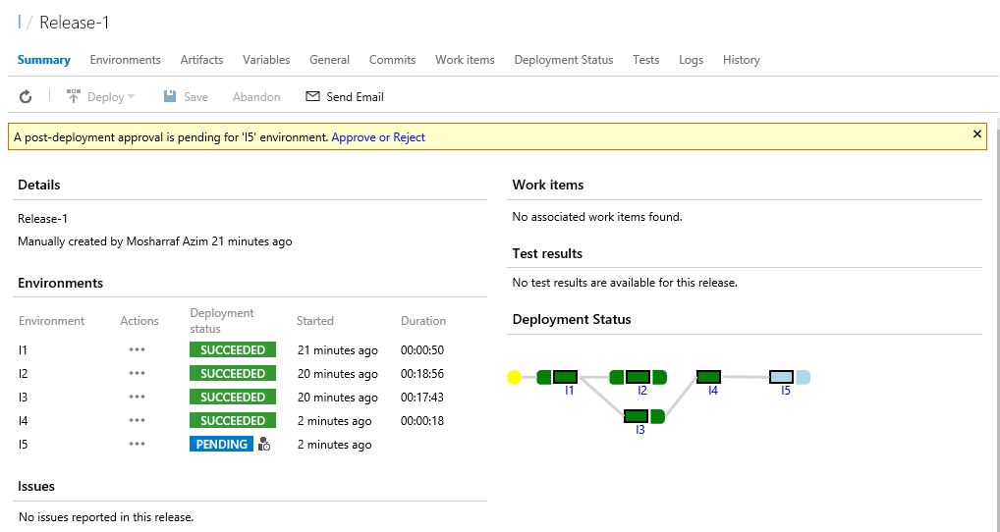
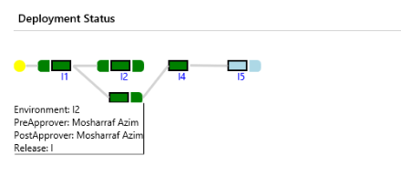
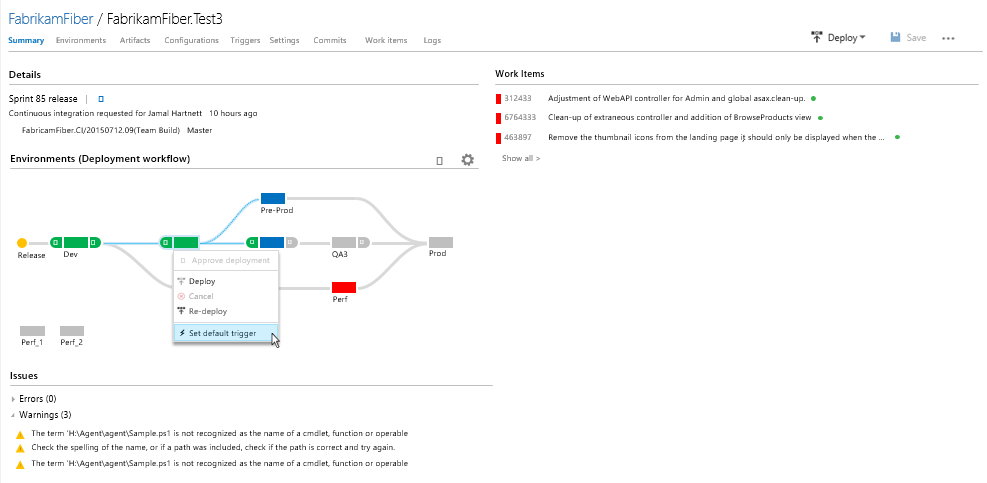

# Deployment Workflow
### Overview
This extension lets you show the deployment workflow in release summary and control the workflow as well. 

### Details:
The workflow graph appears in the release summary tab. The graph conists of nodes which represent the environments and the links represent the depencies between the enviroments.
The graph also shows whether the environment requires preApproval or postAprroval with the appearance of the small nodes before and after each environment node respectively.

####Environment Information 
The information about each environment will appear when one hovers on that environment.

####Change the workflow conditions
This feature lets you change the flow of the release. 
This feature will appear on clicking on the environment.One would be able to deploy, redeploy or set a default trigger. 

